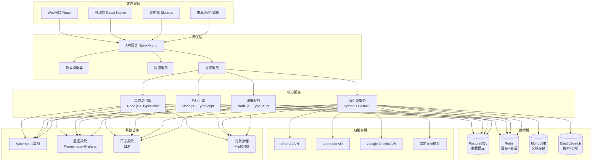

# AI Workspace Orchestrator 架构设计推演

> 项目名称：AI Workspace Orchestrator  
> 设计日期：2026-04-08  
> 设计师：孔明  
> 项目状态：in-progress，已完成API框架和WebSocket，需数据库集成和AI引擎

## 一、技术选型分析

### 1.1 候选方案对比

#### 方案一：全栈Node.js微服务架构
**优势：**
- 统一技术栈，开发效率高
- TypeScript全链路类型安全
- 微服务便于扩展和维护
- 与现有代码一致度高

**劣势：**
- 系统复杂度较高
- 需要服务治理
- 资源消耗较大

**适用场景：** 企业级应用，需要高度可扩展性

#### 方案二：单体架构 + 容器化
**优势：**
- 架构简单，部署便捷
- 开发调试成本低
- 性能优化更容易
- 适合初期快速迭代

**劣势：**
- 扩展性受限
- 技术栈单一
- 长期维护困难

**适用场景：** MVP阶段，快速验证

#### 方案三：混合架构（推荐）
**优势：**
- 核心服务微服务化
- 公共组件服务化
- 渐进式演进
- 平衡扩展性和开发效率

**劣势：**
- 架构设计复杂度中等
- 需要合理的服务边界

**适用场景：** 长期发展，兼顾短期和长期需求

### 1.2 推荐方案：混合微服务架构

**推荐理由：**
1. **技术延续性**：现有Node.js代码基础良好，可平滑迁移
2. **企业级需求**：支持多租户、高并发、可扩展性
3. **成本控制**：按需扩展，资源利用效率高
4. **团队友好**：技术栈统一，学习成本低

## 二、系统架构图



## 三、目录结构设计

```
ai-workspace-orchestrator/
├── packages/                          # 微服务包
│   ├── gateway/                       # API网关
│   │   ├── src/
│   │   │   ├── controllers/
│   │   │   ├── middleware/
│   │   │   ├── services/
│   │   │   └── app.ts
│   │   ├── tests/
│   │   └── package.json
│   ├── workflow-engine/              # 工作流引擎
│   │   ├── src/
│   │   │   ├── handlers/
│   │   │   ├── validators/
│   │   │   ├── services/
│   │   │   └── app.ts
│   │   ├── tests/
│   │   └── package.json
│   ├── execution-engine/              # 执行引擎
│   │   ├── src/
│   │   │   ├── runners/
│   │   │   ├── schedulers/
│   │   │   ├── monitors/
│   │   │   └── app.ts
│   │   ├── tests/
│   │   └── package.json
│   ├── ai-engine/                     # AI引擎
│   │   ├── src/
│   │   │   ├── providers/
│   │   │   ├── processors/
│   │   │   ├── routers/
│   │   │   └── app.ts
│   │   ├── tests/
│   │   └── package.json
│   └── orchestrator/                  # 编排服务
│       ├── src/
│       │   ├── coordinators/
│       │   ├── managers/
│       │   ├── api/
│       │   └── app.ts
│       ├── tests/
│       └── package.json
├── shared/                            # 共享包
│   ├── types/                        # 类型定义
│   ├── utils/                        # 工具函数
│   ├── database/                     # 数据库模式
│   └── api/                          # API文档
├── infrastructure/                    # 基础设施
│   ├── docker/                       # Docker配置
│   ├── kubernetes/                   # K8s配置
│   ├── monitoring/                   # 监控配置
│   └── deployments/                  # 部署脚本
├── docs/                             # 文档
│   ├── architecture/                # 架构文档
│   ├── api/                          # API文档
│   ├── deployment/                  # 部署文档
│   └── development/                  # 开发文档
├── tests/                            # 集成测试
├── scripts/                          # 构建和部署脚本
├── .github/                         # GitHub配置
├── package.json                      # 根包配置
├── README.md                         # 项目说明
└── docker-compose.yml                # 本地开发环境
```

## 四、核心API设计

### 4.1 工作流管理API

```yaml
# 工作流管理端点
POST   /api/v1/workflows            # 创建工作流
GET    /api/v1/workflows           # 获取工作流列表
GET    /api/v1/workflows/:id      # 获取工作流详情
PUT    /api/v1/workflows/:id      # 更新工作流
DELETE /api/v1/workflows/:id      # 删除工作流
POST   /api/v1/workflows/:id/start # 启动工作流
GET    /api/v1/workflows/:id/executions # 获取执行历史
```

### 4.2 执行管理API

```yaml
# 执行管理端点
GET    /api/v1/executions           # 获取执行列表
GET    /api/v1/executions/:id      # 获取执行详情
POST   /api/v1/executions/:id/cancel # 取消执行
GET    /api/v1/executions/stats     # 获取执行统计
GET    /api/v1/executions/logs     # 获取执行日志
```

### 4.3 AI引擎API

```yaml
# AI引擎端点
POST   /api/v1/ai/generate         # 文本生成
POST   /api/v1/ai/analyze          # 文本分析
POST   /api/v1/ai/process          # 文档处理
POST   /api/v1/ai/custom           # 自定义AI任务
GET    /api/v1/ai/providers        # 获取AI提供商列表
POST   /api/v1/ai/providers        # 添加AI提供商
```

### 4.4 编排服务API

```yaml
# 编排服务端点
GET    /api/v1/orchest/status      # 获取编排状态
POST   /api/v1/orchest/schedule    # 调度任务
GET    /api/v1/orchest/jobs        # 获取任务列表
DELETE /api/v1/orchest/jobs/:id   # 取消任务
```

### 4.5 WebSocket事件

```typescript
// WebSocket事件类型
interface WebSocketEvents {
  // 订阅事件
  subscribe: {
    type: 'subscribe';
    channels: string[];
  };
  
  // 工作流事件
  workflow: {
    type: 'workflow.execution';
    data: {
      workflowId: string;
      executionId: string;
      status: 'running' | 'completed' | 'failed' | 'cancelled';
      progress: number;
      message: string;
    };
  };
  
  // 执行步骤事件
  step: {
    type: 'execution.step';
    data: {
      executionId: string;
      stepId: string;
      status: 'pending' | 'running' | 'completed' | 'failed';
      result?: any;
      error?: string;
    };
  };
  
  // AI任务事件
  ai: {
    type: 'ai.task';
    data: {
      taskId: string;
      status: 'pending' | 'running' | 'completed' | 'failed';
      progress: number;
      result?: any;
      error?: string;
    };
  };
}
```

## 五、数据模型设计 (Prisma Schema)

```prisma
// database/schema.prisma
generator client {
  provider = "prisma-client-js"
}

datasource db {
  provider = "postgresql"
  url      = env("DATABASE_URL")
}

// 用户模型
model User {
  id          String   @id @default(cuid())
  email       String   @unique
  name        String
  avatar      String?
  role        UserRole @default(USER)
  createdAt   DateTime @default(now())
  updatedAt   DateTime @updatedAt
  
  // 关系
  workflows   Workflow[]
  executions  Execution[]
  providers   AIProvider[]
  sessions    UserSession[]
  
  @@map("users")
}

// AI提供商模型
model AIProvider {
  id          String      @id @default(cuid())
  name        String
  provider    AIProviderType
  apiKey      String
  model       String
  baseUrl     String?
  config      Json?
  isActive    Boolean     @default(true)
  userId      String
  createdAt   DateTime    @default(now())
  updatedAt   DateTime    @updatedAt
  
  // 关系
  user        User        @relation(fields: [userId], references: [id])
  
  @@map("ai_providers")
}

// 工作流模型
model Workflow {
  id          String      @id @default(cuid())
  name        String
  description String?
  config      Json
  variables   Json?
  status      WorkflowStatus @default(DRAFT)
  userId      String
  createdAt   DateTime    @default(now())
  updatedAt   DateTime    @updatedAt
  lastRunAt   DateTime?
  
  // 关系
  user        User        @relation(fields: [userId], references: [id])
  executions  Execution[]
  templates   WorkflowTemplate[]
  
  @@map("workflows")
}

// 工作流模板模型
model WorkflowTemplate {
  id          String      @id @default(cuid())
  name        String
  description String?
  config      Json
  category    String
  tags        Json?
  isPublic    Boolean     @default(false)
  userId      String
  createdAt   DateTime    @default(now())
  updatedAt   DateTime    @updatedAt
  
  // 关系
  user        User        @relation(fields: [userId], references: [id])
  workflows   Workflow[]
  
  @@map("workflow_templates")
}

// 执行模型
model Execution {
  id          String        @id @default(cuid())
  workflowId  String
  userId      String
  input       Json?
  output      Json?
  status      ExecutionStatus @default(PENDING)
  progress    Int           @default(0)
  startTime   DateTime?
  endTime     DateTime?
  duration    Int?
  error       String?
  logs        Json[]
  
  // 关系
  workflow    Workflow      @relation(fields: [workflowId], references: [id])
  user        User          @relation(fields: [userId], references: [id])
  steps       ExecutionStep[]
  
  @@map("executions")
}

// 执行步骤模型
model ExecutionStep {
  id          String        @id @default(cuid())
  executionId String
  stepId      String
  name        String
  type        StepType
  config      Json
  status      StepStatus    @default(PENDING)
  order       Int
  startTime   DateTime?
  endTime     DateTime?
  duration    Int?
  result      Json?
  error       String?
  
  // 关系
  execution   Execution     @relation(fields: [executionId], references: [id])
  
  @@map("execution_steps")
}

// 用户会话模型
model UserSession {
  id          String    @id @default(cuid())
  userId      String
  token       String    @unique
  expiresAt   DateTime
  isActive    Boolean   @default(true)
  createdAt   DateTime  @default(now())
  updatedAt   DateTime  @updatedAt
  
  // 关系
  user        User      @relation(fields: [userId], references: [id])
  
  @@map("user_sessions")
}

// 枚举类型
enum UserRole {
  USER
  ADMIN
  SUPER_ADMIN
}

enum AIProviderType {
  OPENAI
  ANTHROPIC
  GOOGLE
  CUSTOM
}

enum WorkflowStatus {
  DRAFT
  ACTIVE
  PAUSED
  ARCHIVED
}

enum ExecutionStatus {
  PENDING
  RUNNING
  COMPLETED
  FAILED
  CANCELLED
}

enum StepType {
  AI_TASK
  CONDITION
  PARALLEL
  SEQUENTIAL
  DATA_PROCESSING
  API_CALL
}

enum StepStatus {
  PENDING
  RUNNING
  COMPLETED
  FAILED
  SKIPPED
}
```

## 六、关键技术难点及解决方案

### 6.1 工作流编排复杂性

**挑战：**
- 复杂的条件分支和并行处理
- 步骤间的数据传递和状态同步
- 长时间运行任务的可靠性

**解决方案：**
1. **状态机模式**：使用状态机管理工作流状态转换
2. **事件驱动架构**：通过事件总线实现步骤间通信
3. **持久化执行**：实现任务检查点和恢复机制
4. **超时处理**：为每个步骤设置超时和重试策略

```typescript
// 工作流状态管理
class WorkflowStateMachine {
  private currentState: WorkflowState;
  private context: ExecutionContext;
  
  async transition(event: WorkflowEvent): Promise<WorkflowState> {
    const nextState = this.getStateTransition(this.currentState, event);
    
    if (this.isValidTransition(this.currentState, nextState)) {
      await this.executeStateHooks(this.currentState, nextState);
      this.currentState = nextState;
      this.context.updateState(nextState);
      return nextState;
    }
    
    throw new InvalidTransitionError(this.currentState, nextState);
  }
}
```

### 6.2 AI服务集成复杂性

**挑战：**
- 多AI提供商的统一接口
- 服务的容错和降级
- 成本控制和优化

**解决方案：**
1. **适配器模式**：为每个AI提供商实现统一接口
2. **负载均衡**：智能路由和负载分配
3. **熔断机制**：防止级联故障
4. **缓存优化**：结果缓存和复用

```typescript
// AI服务适配器
interface AIProviderAdapter {
  generateText(params: GenerationParams): Promise<GenerationResult>;
  analyzeText(params: AnalysisParams): Promise<AnalysisResult>;
  processDocument(params: DocumentParams): Promise<DocumentResult>;
}

class OpenAIAdapter implements AIProviderAdapter {
  async generateText(params: GenerationParams): Promise<GenerationResult> {
    // OpenAI具体实现
  }
}

class AnthropicAdapter implements AIProviderAdapter {
  async generateText(params: GenerationParams): Promise<GenerationResult> {
    // Anthropic具体实现
  }
}

// AI服务管理器
class AIServiceManager {
  private providers: Map<string, AIProviderAdapter> = new Map();
  private loadBalancer: LoadBalancer;
  
  async routeRequest(provider: string, task: AITask): Promise<any> {
    const adapter = this.providers.get(provider);
    if (!adapter) throw new ProviderNotFoundError(provider);
    
    return this.loadBalancer.execute(adapter, task);
  }
}
```

### 6.3 高并发和性能优化

**挑战：**
- 大量并发执行任务
- 实时状态更新
- 系统资源优化

**解决方案：**
1. **异步处理**：使用消息队列处理耗时任务
2. **连接池**：数据库连接池和HTTP连接池
3. **缓存策略**：Redis缓存热点数据
4. **CDN加速**：静态资源CDN分发

```typescript
// 异步任务处理
class AsyncTaskProcessor {
  private queue: BullMQ.Queue;
  private worker: BullMQ.Worker;
  
  constructor() {
    this.queue = new BullMQ.Queue('ai-tasks');
    this.worker = new BullMQ.Worker('ai-tasks', this.processTask.bind(this));
  }
  
  async processTask(job: BullMQ.Job): Promise<any> {
    const { task, provider, params } = job.data;
    
    try {
      const result = await this.executeAIProvider(task, provider, params);
      await this.updateExecutionProgress(job.id, 100, result);
      return result;
    } catch (error) {
      await this.updateExecutionProgress(job.id, 0, null, error);
      throw error;
    }
  }
}
```

### 6.4 数据一致性和持久化

**挑战：**
- 分布式事务一致性
- 数据库性能优化
- 数据备份和恢复

**解决方案：**
1. **事务管理**：使用数据库事务确保一致性
2. **读写分离**：主从数据库架构
3. **数据分片**：水平分片处理大数据量
4. **定期备份**：自动化备份和恢复机制

```typescript
// 数据库事务管理
class TransactionManager {
  async executeInTransaction<T>(operation: () => Promise<T>): Promise<T> {
    const tx = await db.$begin();
    
    try {
      const result = await operation();
      await tx.$commit();
      return result;
    } catch (error) {
      await tx.$rollback();
      throw error;
    }
  }
}
```

### 6.5 安全和隐私保护

**挑战：**
- 用户数据安全
- AI内容安全
- 访问控制

**解决方案：**
1. **身份认证**：JWT + OAuth2.0
2. **权限控制**：RBAC权限模型
3. **数据加密**：敏感数据加密存储
4. **内容过滤**：AI内容安全检测

```typescript
// 安全中间件
class SecurityMiddleware {
  async authenticate(req: Request, res: Response, next: NextFunction) {
    const token = req.headers.authorization?.replace('Bearer ', '');
    
    if (!token) {
      return res.status(401).json({ error: 'Unauthorized' });
    }
    
    try {
      const decoded = jwt.verify(token, process.env.JWT_SECRET);
      req.user = decoded;
      next();
    } catch (error) {
      return res.status(401).json({ error: 'Invalid token' });
    }
  }
  
  async checkPermission(resource: string, action: string) {
    return (req: Request, res: Response, next: NextFunction) => {
      const user = req.user;
      
      if (!this.hasPermission(user, resource, action)) {
        return res.status(403).json({ error: 'Forbidden' });
      }
      
      next();
    };
  }
}
```

## 七、实施路径

### 7.1 第一阶段：基础架构搭建 (2-3个月)
1. 完成数据库集成和Prisma配置
2. 实现基础的AI服务适配器
3. 完善工作流引擎核心功能
4. 建立监控和日志系统

### 7.2 第二阶段：功能完善 (3-4个月)
1. 实现高级工作流编排功能
2. 完成AI服务集成优化
3. 建立测试体系
4. 实现部署自动化

### 7.3 第三阶段：企业级特性 (2-3个月)
1. 实现多租户支持
2. 完善权限和安全体系
3. 建立性能优化机制
4. 实现高可用架构

### 7.4 第四阶段：生态建设 (1-2个月)
1. 开发插件系统
2. 建立开发者社区
3. 完善文档和教程
4. 发布正式版本

## 八、技术栈总结

| 层级 | 技术选型 | 用途 |
|------|----------|------|
| 前端 | React + TypeScript | 用户界面 |
| 后端 | Node.js + TypeScript | 业务逻辑 |
| 数据库 | PostgreSQL + Redis | 数据存储 |
| AI服务 | OpenAI + Anthropic + Google | AI能力 |
| 容器化 | Docker + Kubernetes | 部署和管理 |
| 监控 | Prometheus + Grafana | 系统监控 |
| 消息队列 | Redis + BullMQ | 异步任务 |
| 缓存 | Redis + CDN | 性能优化 |

## 九、风险控制和优化建议

### 9.1 技术风险
- **技术债务**：定期代码审查和重构
- **依赖风险**：建立依赖管理和监控机制
- **性能瓶颈**：建立性能监控和预警

### 9.2 业务风险
- **需求变更**：采用敏捷开发，快速响应
- **市场竞争**：持续创新，保持技术领先
- **用户增长**：设计可扩展架构

### 9.3 优化建议
1. **性能优化**：建立性能基准测试
2. **成本控制**：AI服务使用优化和监控
3. **用户体验**：建立用户反馈机制
4. **团队协作**：完善开发流程和工具

---

**总结：** 本架构设计采用混合微服务架构，平衡了技术复杂性和业务需求，通过分层设计和模块化架构确保系统的可扩展性和可维护性。重点关注AI服务集成、工作流编排和高并发处理等关键技术难点，为项目的长期发展奠定坚实基础。